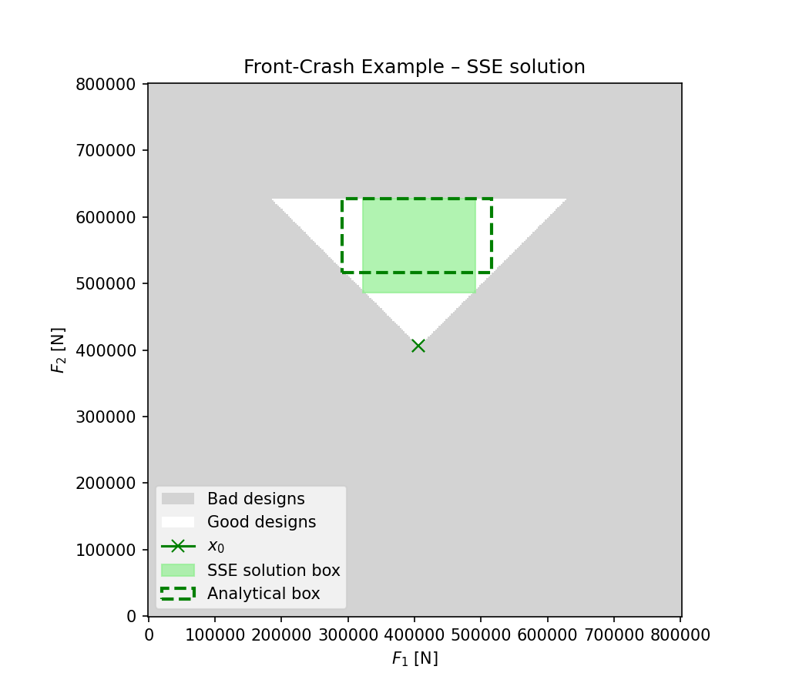
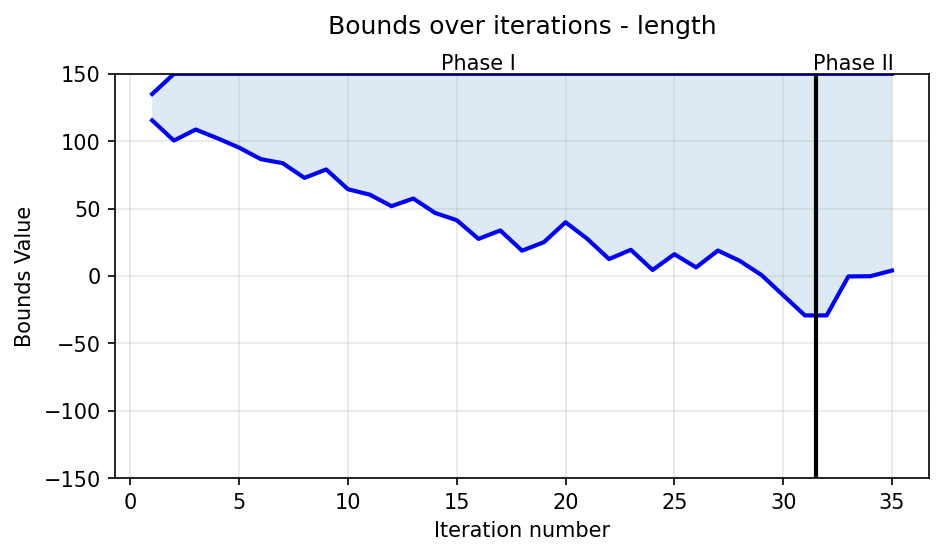
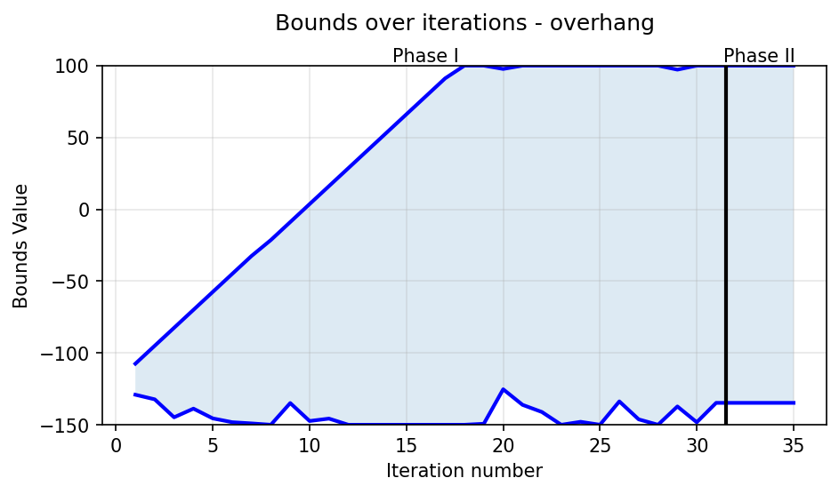
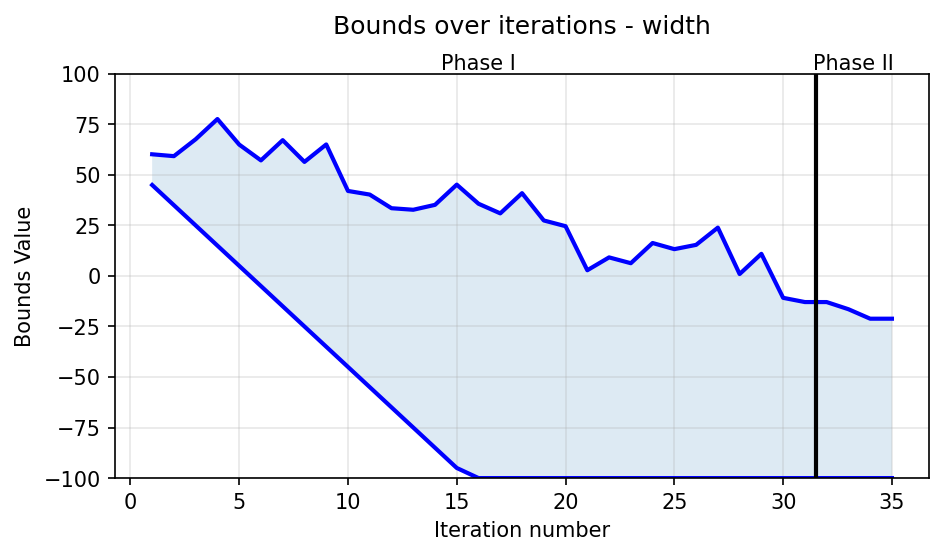
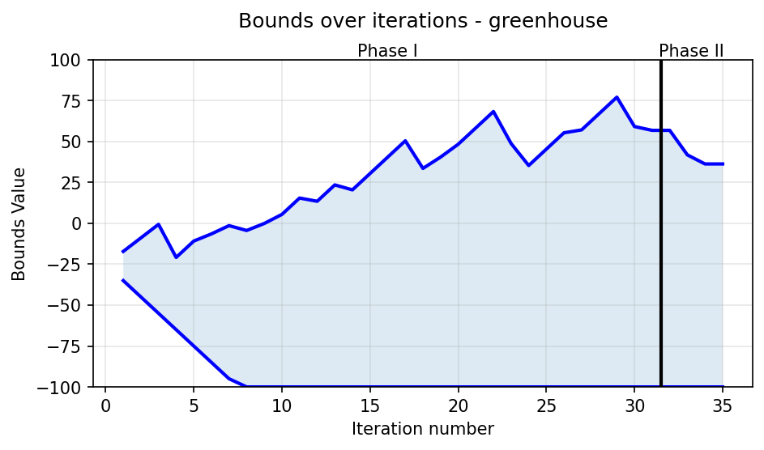

# Solution Space Engineering (SSE)

## Motivation
- In early engineering design phases, there is high uncertainty in final specifications, materials, manufacturing methods, and regulatory requirements. The earlier in the design phase, the larger are the possible changes to design parameters.
- Traditional optimization approaches produce designs that are extremely sensitive to parameter changes. Inevitable later-stage adjustments can trigger extensive redesign and high costs.
- Traditional optimization methods may be ill-suited or inefficient for complex real-world problems.

## Description
### Managing Uncertainty through Solution Spaces
- Instead of identifying a single optimized design point, SSE identifies a multi-dimensional solution box.
- For each design parameter, a permissible range interval is defined independently from other
parameters. A solution box is a product of these intervals in the entire design space.
- This independence significantly reduces sensitivity, as changes in one parameter rarely require
simultaneous redesign of other parameters.
- Uncertainties in early design phases and inevitable later-stage adjustments can be accommodated
without extensive redesign.
### Application to Complex Problems
- SSE can be used for arbitrary non-linear high dimensional problems.
- SSE quickly converges to solution, making it computationally practical for problems where traditional
optimization would require an infeasible number of evaluations.

## Example Problem 1: Front Crash
- Assume a vehicle front structure designed for a front crash against a rigid barrier with deformation possible at the
deformation forces F1 and F2.
- The system design goals for the crash performance are: 1) Keep the deceleration a of the passenger cell below a critical
threshold level, and 2) Ensure an ordered deformation starting from the front of the vehicle.
- Classical performance optimum shown below as x0: it is not robust as any increase of F1 or decrease of F2 will cause the order of deformation to change, and any decrease of F1 will prevent sufficient energy absorption.
- Using the entire solution space instead would also be impractical, as the tolerable range for F1 would depend on the choice of F2.
- Instead, a practical design goal is to find an interval for each force, such that the performance criterion is satisfied for all combinations within these bounds, and each interval is independent of the other. Maximum flexibility is provided if the intervals are as large as possible.
- Below is shown an optimal box consisted of such intervals, and a solution box that SSE provides; they both satisfy the performance criterion, and differ in size by <5%, proving SSE gives close to optimal solution. 

## Example Problem 2: AERIS Demo
- Assume a pre-trained NN that given vehicle dimensions, outputs the drag coefficient CD.
- Assume you only want to change the following dimensions within pre-defined intervals: lenght, overhang, width, greenhouse.
- The system design for the example is finding all vehicle designs that satisfy your defined drag coefficient requirement.

