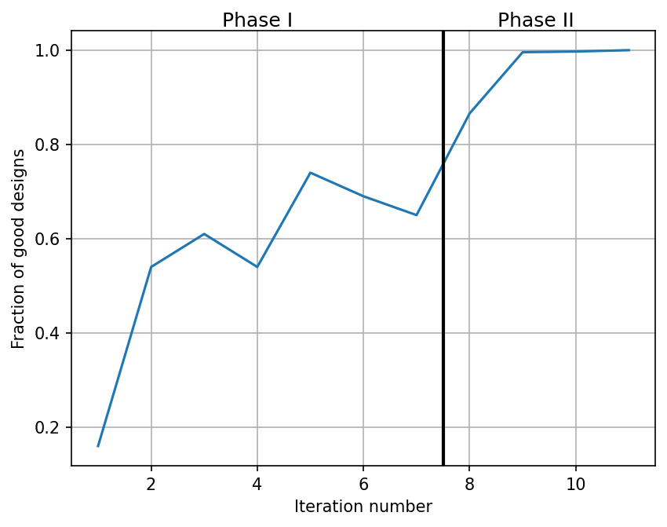
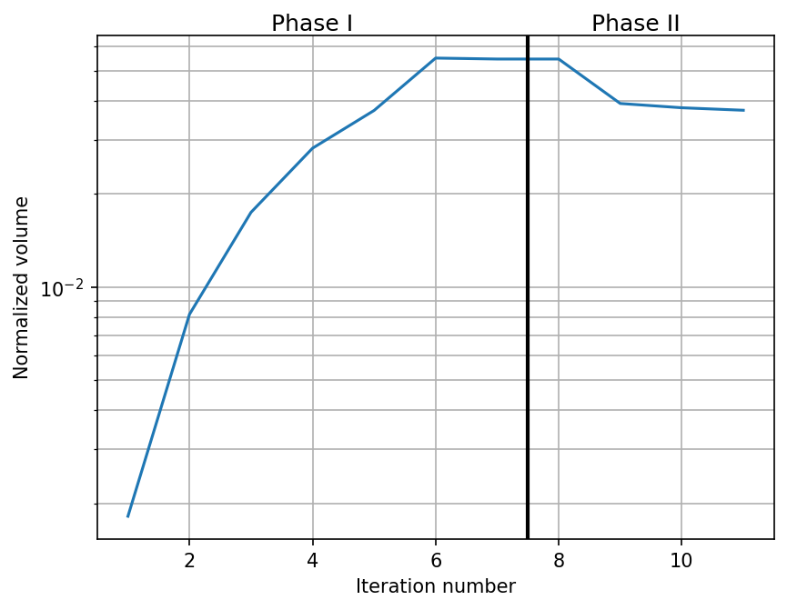
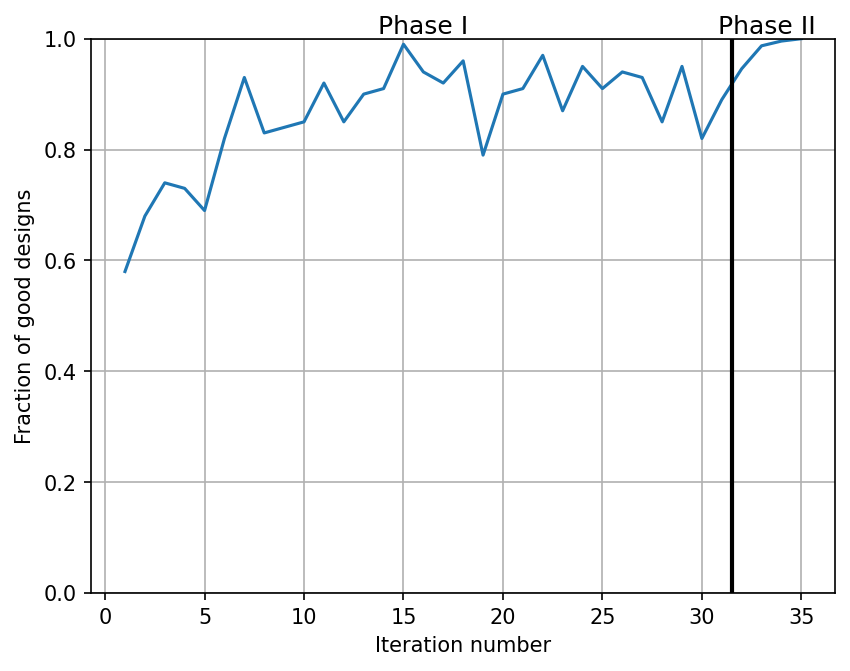
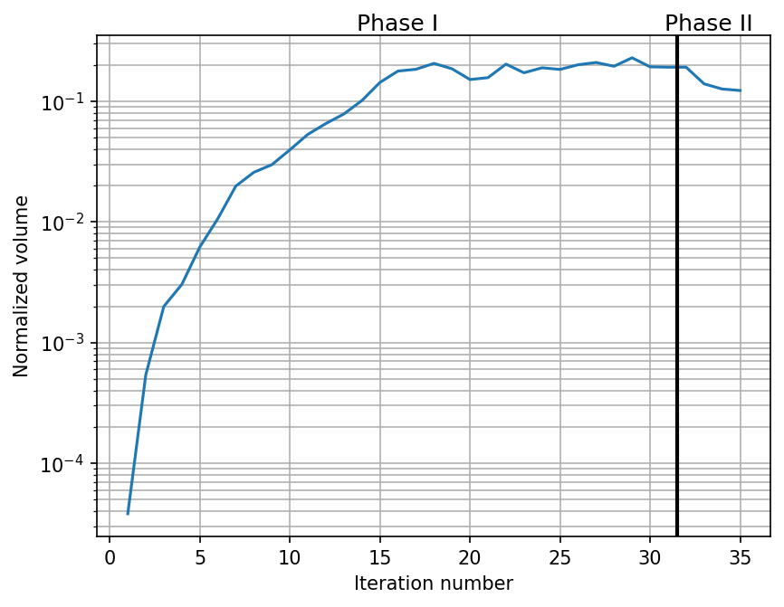

# Solution Space Engineering (SSE)

## Motivation
- In early engineering design phases, there is high uncertainty in final specifications, materials, manufacturing methods, and regulatory requirements. The earlier in the design phase, the larger are the possible changes to design parameters.
- Traditional optimization approaches produce designs that are extremely sensitive to parameter changes. Inevitable later-stage adjustments can trigger extensive redesign and high costs.

## Description
TODO

## Front Crash Demo

## AERIS Demo

